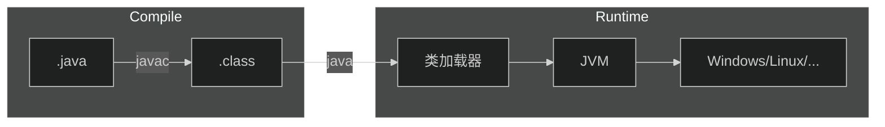

[TOC]

# 1.JavaSE

## 1.JavaSE初步

### 1.什么是Java？

+ Java最初是由Sun公司研发的一款高级语言，Java的底层是由C++来编写的
+ 随后Oracle公司收购了Sun公司，从此Java便开始由Oracle维护


### 2.Java的特性

+ 简单性
    + Java中没有多继承的概念
    + Java屏蔽了指针的概念
    + 所以说Java相对来说是简单的

+ 面向对象
    + Java是纯面向对象的，更符合人的思维模式

+ 可移植性
    + Java代码只需要编译一次就可以在任意的平台上执行
    + Sun公司让Java代码运行在JVM(Java Virtual Machine)--Java虚拟机中，这样就屏蔽了操作系统的不同，对于Java代码来说他们只是在JVM中运行，不需要考虑操作系统的不同
+ 多线程
+ 健壮性
    + Java中有一个垃圾回收机制，Java在运行过程中的垃圾会自动的回收，不用程序员操心


### 3.Java的加载与执行

+ 编译阶段
    + 程序员首先需要创建一个Java源文件
    + Java源文件是以`.java`为结尾的文件
    + 文件中编写的源代码必须是符合Java语言规范的代码
    + 一个Java源文件可以生成一个或者多个`.class`字节码文件
+ 执行阶段
    + 当我们执行运行程序时，JVM会启动类加载器ClassLoader
    + 类加载器会到磁盘上寻找`.class`文件，找到后会将字节码文件装载到JVM当中
    + JVM将字节码文件解释成二进制数据，这样操作系统就会和底层硬件去交互




### 4.Java的安装

+ 要在我们的电脑上编写Java代码，第一件事就是安装JDK
+ 什么是JDK？

    + JDK是`Java Development Kit`--Java语言软件开发包，其中包括了JRE `Java Runtime Environment`--Java运行环境，还有Java自带的一些类库，如`rt.jar`和Java的基础工具`java,javac,jdb...`
+ 什么是JRE？

    + JRE是Java程序运行时必不可少的运行环境，JRE与JDK不同的就是JRE只能供字节码文件运行，不支持Java程序的开发
+ 如何安装Java？

    + 那么现在我们既要编写Java程序，也要运行Java程序，那么我们需要安装的就是JDK了，首先去[Oracle官网](https://www.oracle.com/java/technologies/downloads/)下载JDK
    + 首先选择我们的平台(windows,Linux,...)，然后选择合适的版本，一般来说我们会使用`Java8`和`Java17`，因为这两个版本的Java都是长期支持的版本(LTS)
    + 那这里以Java8在Ubuntu的安装为例，首先下载好Java8的`.tar.gz`文件，解压到桌面后移动到`/usr/local/java`文件夹下
    + 配置环境变量，因为即使你把Java的文件解压出来系统是不会知道你安装了Java的，需要你配置环境变量来告诉系统你安装了Java
    + 打开`terminal`使用命令`sudo vi /etc/profile`，在文件的开头添加下面的内容
    + `export JAVA_HOME=/usr/local/java`
    + `export PATH=$PATH:$JAVA_HOME/bin`
    + `export CLASSPATH=.:$JAVA_HOME/lib/dt.jar:$JAVA_HOME/lib/tools.jar`
    + 添加环境变量后，在终端中输入`java -version`，如果出现了Java的版本信息，那么就算配置成功了


### 5.在IDEA中配置Java环境

+ 在现代的开发工作中，已经不会再使用命令行去开发，一般都会使用集成工作环境去进行项目的管理，常用的IDE工具有IDEA，Eclipse...，但是目前一般都使用IDEA作为集成开发环境
+ 配置Java环境
    + 在IDEA中打开File-->Project Structure-->Project，在SDK中选择我们安装Java的目录，在下面出现版本信息后，就说明引入成功了


### 6.第一个Java程序

+ 在IDEA中新建一个Project，在src目录下新建Java源文件，并输入下面的内容

    + ```java
        public class Main {
            public static void main(String[] args){
                System.out.println("hello world!");
            }
        }
        ```

+ 点击右上角的`▶`，运行当前的程序

+ 在下面控制台中出现了`hello world!`的字样，表示我们的程序运行成功了


### 7.Java注释

+ 在Java中，我们可以编写注释，注释可以让我们程序的可读性大大提高，当代码量极大时，编写注释是必须的
+ 如何编写注释？
    + 使用`//`来表示单行注释，在这一行中编写的任何内容都不会作为源代码编译
    + 使用`/** */`来进行多行注释，在这些行中的编写的内容会有一个格式规范，因为这样的注解可以通过`JavaDoc`生成帮助文档


## 2.JavaSE基础

### 1.Java中类的概念

+ 因为Java是一门面向对象的语言，所以Java中有一个叫做类的概念，所有的源代码都需要编写在类中
+ 类是什么？
    + 当Java程序员对现实世界进行观察，将一些物体的特征提取出来，所有的物体都有这个特征，那么这个提取出来的集合就变成了类`class`
+ 什么是对象？
    + 当我们想要用一个类去表达一个物体时，我们就需要用类去描述这个物体，拥有具体描述的类就变成了对象`object`


### 2.类的编写

+ 假如我们创建了一个Java源文件叫做`Hello.java`，那么在这个类中的公共类必须叫做`Hello`，这是什么意思呢？

    + ```java
        //Hello.java
        public class Hello {
            
        }
        ```

+ 跟在`class`后面的标识符就是`类名`，一个Java源文件中只能有一个公共类，这是什么意思？

    + 从上面的例子我们可以知道，`class`的前面还要有`public`，一个类中只能有一个由`public`修饰的类
    + 如果想编写更多的类，就只能写`class 类名`，但是在实际的开发中，我们一般一个源文件只编写一个类

+ 在[上文](#3.Java的加载与执行)中我们提到，一个源文件可以编译生成一个或者多个字节码文件，这是什么意思？

    + 其实每个字节码文件`.class`都对应一个类，当我们在一个源文件中编写多个类时，就会生成多个字节码文件


### 3.标识符

+ 在Java中，凡是能让我们自己命名的东西，都叫做`标识符`
+ 比如类名，变量名，方法名，接口名...
+ 标识符的命名规范
    + 标识符是只能由字母，数字，下划线，美元符号构成的
    + 必须以字母，下划线或者美元符号开始，不能以数字开始
    + 关键字不能作为标识符
+ 在开发中的标识符命名规范
    + 标识符一般遵循驼峰命名规范，即每个单词的首字母大写，如`HelloTest,actNo`
    + 类名第一个单词首字母大写
    + 方法名，变量名第一个单词小写
    + 常量名，每个字母都是大写，单词之间使用`_`隔开


### 4.数据类型

+ Java中总的来说有两种数据类型，基本数据类型和引用数据类型
+ 基本数据类型
    + 数值型byte,short,int,long,float,double
    + 字符型char
    + 布尔型boolean
+ 引用数据类型
    + 数组
    + 类
    + 接口


### 5.变量

+ 变量是Java中最基本的单元
+ 变量的定义
    + [修饰词] 变量类型 标识符 = 值/null;
    + [修饰词] 变量类型 标识符;


### 6.运算符

+ Java中的运算符基本与C++一致


### 7.控制语句

+ Java中的控制语句基本与C++一致


### 8.方法

+ Java中的方法其实相当于C++中的函数
+ Java中定义方法
    + [修饰词] 返回值类型 方法名 (参数列表){}
+ 方法的重载
    + 什么是方法的重载(Overload)？
        + 当我们需要一个方法提供不同的功能时，可以通过改变参数列表和返回值来实现
    + 怎么实现方法的重载？
        + `方法名相同`
        + 方法的参数类型，个数，顺序，这三者至少有一者不同
        + 方法的返回类型不同（不以返回类型来区分方法的重载）
        + 方法的修饰符可以同
        + `方法的重载只出现在一个类中`
+ 方法的覆盖
    + 什么是方法的覆盖(Override)？
        + 当我们的类继承父类时会继承父类的方法，当父类的方法无法满足我们的需求时，需要覆盖/重写父类的方法
    + 怎么实现方法的覆盖？
        + `需要继承一个父类`
        + `只能改变参数的标识符和方法体，其他东西不能改变`
+ 方法的实现
    + 什么是方法的实现？
        + 当我们的类继承了一个抽象类或者实现了多个接口，我们需要对里面的方法进行实现


### 9.类的运行

+ 当我们想要运行一个类时，类中必须要有`main`方法，主方法的编写是固定的模式，不要进行修改

    + ```java
        public static void main(String[] args){
        	//方法体        
        }
        ```

+ 除了变量的定义之外，所有的运行语句都需要放在方法中


## 3.JavaSE面向对象


