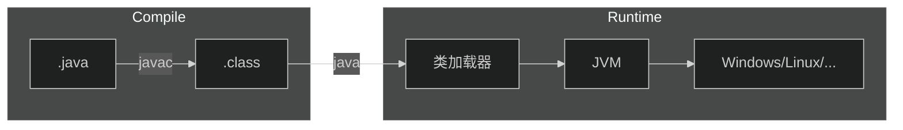

[TOC]

# 1.JavaSE

## 1.JavaSE初步

### 1.什么是Java？

+ Java最初是由Sun公司研发的一款高级语言，Java的底层是由C++来编写的
+ 随后Oracle公司收购了Sun公司，从此Java便开始由Oracle维护

### 2.Java的特性

+ 简单性
    + Java中没有多继承的概念
    + Java屏蔽了指针的概念
    + 所以说Java相对来说是简单的

+ 面向对象
    + Java是纯面向对象的，更符合人的思维模式

+ 可移植性
    + Java代码只需要编译一次就可以在任意的平台上执行
    + Sun公司让Java代码运行在JVM(Java Virtual Machine)--Java虚拟机中，这样就屏蔽了操作系统的不同，对于Java代码来说他们只是在JVM中运行，不需要考虑操作系统的不同
+ 多线程
+ 健壮性
    + Java中有一个垃圾回收机制，Java在运行过程中的垃圾会自动的回收，不用程序员操心

### 3.Java的加载与执行

+ 编译阶段
    + 程序员首先需要创建一个Java源文件
    + Java源文件是以`.java`为结尾的文件
    + 文件中编写的源代码必须是符合Java语言规范的代码
    + 一个Java源文件可以生成一个或者多个`.class`字节码文件
+ 执行阶段
    + 当我们执行运行程序时，JVM会启动类加载器ClassLoader
    + 类加载器会到磁盘上寻找`.class`文件，找到后会将字节码文件装载到JVM当中
    + JVM将字节码文件解释成二进制数据，这样操作系统就会和底层硬件去交互

### 4.Java的安装

+ 要在我们的电脑上编写Java代码，第一件事就是安装JDK

+ 什么是JDK？

    + JDK是`Java Development Kit`--Java语言软件开发包，其中包括了JRE `Java Runtime Environment`--Java运行环境，还有Java自带的一些类库，如`rt.jar`和Java的基础工具`java,javac,jdb...`

+ 什么是JRE？

    + JRE是Java程序运行时必不可少的运行环境，JRE与JDK不同的就是JRE只能供字节码文件运行，不支持Java程序的开发

+ 如何安装Java？

    + 那么现在我们既要编写Java程序，也要运行Java程序，那么我们需要安装的就是JDK了，首先去[Oracle官网](https://www.oracle.com/java/technologies/downloads/)下载JDK

    + 首先选择我们的平台(windows,Linux,...)，然后选择合适的版本，一般来说我们会使用Java8和Java17，因为这两个版本的Java都是长期支持的版本(LTS)

    + 那这里以Java8在Ubuntu的安装为例，首先下载好Java8的`.tar.gz`文件，解压到桌面后移动到`/usr/local/java`文件夹下

    + 配置环境变量，因为即使你把Java的文件解压出来系统是不会知道你安装了Java的，需要你配置环境变量来告诉系统你安装了Java

    + 打开`terminal`使用命令`sudo vi /etc/profile`，在文件的开头添加下面的内容

    + `export JAVA_HOME=/usr/local/java`

    + `export PATH=$PATH:$JAVA_HOME/bin`

    + `export CLASSPATH=.:$JAVA_HOME/lib/dt.jar:$JAVA_HOME/lib/tools.jar`

    + 

        

