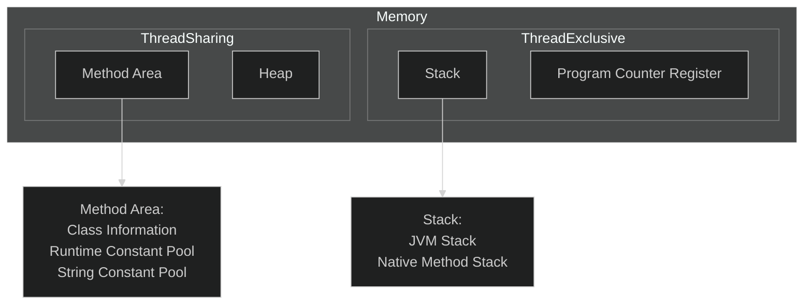

[TOC]

# 1.JavaSE

## 1.JavaSE初步

### 1.什么是Java？

+ Java最初是由Sun公司研发的一款高级语言，Java的底层是由C++来编写的
+ 随后Oracle公司收购了Sun公司，从此Java便开始由Oracle维护


### 2.Java的特性

+ 简单性
    + Java中没有多继承的概念
    + Java屏蔽了指针的概念
    + 所以说Java相对来说是简单的

+ 面向对象
    + Java是纯面向对象的，更符合人的思维模式

+ 可移植性
    + Java代码只需要编译一次就可以在任意的平台上执行
    + Sun公司让Java代码运行在JVM(Java Virtual Machine)--Java虚拟机中，这样就屏蔽了操作系统的不同，对于Java代码来说他们只是在JVM中运行，不需要考虑操作系统的不同
+ 多线程
+ 健壮性
    + Java中有一个垃圾回收机制，Java在运行过程中的垃圾会自动的回收，不用程序员操心


### 3.Java的加载与执行

+ 编译阶段
    + 程序员首先需要创建一个Java源文件
    + Java源文件是以`.java`为结尾的文件
    + 文件中编写的源代码必须是符合Java语言规范的代码
    + 一个Java源文件可以生成一个或者多个`.class`字节码文件
+ 执行阶段
    + 当我们执行运行程序时，JVM会启动类加载器ClassLoader
    + 类加载器会到磁盘上寻找`.class`文件，找到后会将字节码文件装载到JVM当中
    + JVM将字节码文件解释成二进制数据，这样操作系统就会和底层硬件去交互


### 4.Java的安装

+ 要在我们的电脑上编写Java代码，第一件事就是安装JDK
+ 什么是JDK？

    + JDK是`Java Development Kit`--Java语言软件开发包，其中包括了JRE `Java Runtime Environment`--Java运行环境，还有Java自带的一些类库，如`rt.jar`和Java的基础工具`java,javac,jdb...`
+ 什么是JRE？

    + JRE是Java程序运行时必不可少的运行环境，JRE与JDK不同的就是JRE只能供字节码文件运行，不支持Java程序的开发
+ 如何安装Java？

    + 那么现在我们既要编写Java程序，也要运行Java程序，那么我们需要安装的就是JDK了，首先去[Oracle官网](https://www.oracle.com/java/technologies/downloads/)下载JDK
    + 首先选择我们的平台(windows,Linux,...)，然后选择合适的版本，一般来说我们会使用`Java8`和`Java17`，因为这两个版本的Java都是长期支持的版本(LTS)
    + 那这里以Java8在Ubuntu的安装为例，首先下载好Java8的`.tar.gz`文件，解压到桌面后移动到`/usr/local/java`文件夹下
    + 配置环境变量，因为即使你把Java的文件解压出来系统是不会知道你安装了Java的，需要你配置环境变量来告诉系统你安装了Java
    + 打开`terminal`使用命令`sudo vi /etc/profile`，在文件的开头添加下面的内容
    + `export JAVA_HOME=/usr/local/java`
    + `export PATH=$PATH:$JAVA_HOME/bin`
    + `export CLASSPATH=.:$JAVA_HOME/lib/dt.jar:$JAVA_HOME/lib/tools.jar`
    + 添加环境变量后，在终端中输入`java -version`，如果出现了Java的版本信息，那么就算配置成功了


### 5.在IDEA中配置Java环境

+ 在现代的开发工作中，已经不会再使用命令行去开发，一般都会使用集成工作环境去进行项目的管理，常用的IDE工具有IDEA，Eclipse...，但是目前一般都使用IDEA作为集成开发环境
+ 配置Java环境
    + 在IDEA中打开File-->Project Structure-->Project，在SDK中选择我们安装Java的目录，在下面出现版本信息后，就说明引入成功了


### 6.第一个Java程序

+ 在IDEA中新建一个Project，在src目录下新建Java源文件，并输入下面的内容

    + ```java
        public class Main {
            public static void main(String[] args){
                System.out.println("hello world!");
            }
        }
        ```

+ 点击右上角的`▶`，运行当前的程序

+ 在下面控制台中出现了`hello world!`的字样，表示我们的程序运行成功了


### 7.Java注释

+ 在Java中，我们可以编写注释，注释可以让我们程序的可读性大大提高，当代码量极大时，编写注释是必须的
+ 如何编写注释？
    + 使用`//`来表示单行注释，在这一行中编写的任何内容都不会作为源代码编译
    + 使用`/** */`来进行多行注释，在这些行中的编写的内容会有一个格式规范，因为这样的注解可以通过`JavaDoc`生成帮助文档


## 2.JavaSE基础

### 1.Java中类的概念

+ 因为Java是一门面向对象的语言，所以Java中有一个叫做类的概念，所有的源代码都需要编写在类中
+ 类是什么？
    + 当Java程序员对现实世界进行观察，将一些物体的特征提取出来，所有的物体都有这个特征，那么这个提取出来的集合就变成了类`class`
+ 什么是对象？
    + 当我们想要用一个类去表达一个物体时，我们就需要用类去描述这个物体，拥有具体描述的类就变成了对象`object`


### 2.类的编写

+ 假如我们创建了一个Java源文件叫做`Hello.java`，那么在这个类中的公共类必须叫做`Hello`，这是什么意思呢？

    + ```java
        //Hello.java
        public class Hello {
            
        }
        ```

+ 跟在`class`后面的标识符就是`类名`，一个Java源文件中只能有一个公共类，这是什么意思？

    + 从上面的例子我们可以知道，`class`的前面还要有`public`，一个类中只能有一个由`public`修饰的类
    + 如果想编写更多的类，就只能写`class 类名`，但是在实际的开发中，我们一般一个源文件只编写一个类

+ 在[上文](#3.Java的加载与执行)中我们提到，一个源文件可以编译生成一个或者多个字节码文件，这是什么意思？

    + 其实每个字节码文件`.class`都对应一个类，当我们在一个源文件中编写多个类时，就会生成多个字节码文件


### 3.标识符

+ 在Java中，凡是能让我们自己命名的东西，都叫做`标识符`
+ 比如类名，变量名，方法名，接口名...
+ 标识符的命名规范
    + 标识符是只能由字母，数字，下划线，美元符号构成的
    + 必须以字母，下划线或者美元符号开始，不能以数字开始
    + 关键字不能作为标识符
+ 在开发中的标识符命名规范
    + 标识符一般遵循驼峰命名规范，即每个单词的首字母大写，如`HelloTest,actNo`
    + 类名第一个单词首字母大写
    + 方法名，变量名第一个单词小写
    + 常量名，每个字母都是大写，单词之间使用`_`隔开


### 4.数据类型

+ Java中总的来说有两种数据类型，基本数据类型和引用数据类型
+ 基本数据类型
    + 数值型byte,short,int,long,float,double
    + 字符型char
    + 布尔型boolean
+ 引用数据类型
    + 数组
    + 类
    + 接口


### 5.变量

+ 变量是Java中最基本的单元
+ 变量的定义
    + [修饰词] 变量类型 标识符 = 值/null;
    + [修饰词] 变量类型 标识符;
+ 在类体中定义的变量叫做`属性`


### 6.运算符

+ Java中的运算符基本与C++一致


### 7.控制语句

+ Java中的控制语句基本与C++一致


### 8.方法

+ Java中的方法其实相当于C++中的函数
+ Java中定义方法
    + [修饰词] 返回值类型 方法名 (参数列表){}
+ 方法的重载
    + 什么是方法的重载(Overload)？
        + 当我们需要一个方法提供不同的功能时，可以通过改变参数列表和返回值来实现
    + 怎么实现方法的重载？
        + `方法名相同`
        + 方法的参数类型，个数，顺序，这三者至少有一者不同
        + 方法的返回类型不同（不以返回类型来区分方法的重载）
        + 方法的修饰符可以同
        + `方法的重载只出现在一个类中`
+ 方法的覆盖
    + 什么是方法的覆盖(Override)？
        + 当我们的类继承父类时会继承父类的方法，当父类的方法无法满足我们的需求时，需要覆盖/重写父类的方法
    + 怎么实现方法的覆盖？
        + `需要继承一个父类`
        + `只能改变参数的标识符和方法体，其他东西不能改变`
+ 方法的实现
    + 什么是方法的实现？
        + 当我们的类继承了一个抽象类或者实现了多个接口，我们需要对里面的方法进行实现


### 9.类的运行

+ 当我们想要运行一个类时，类中必须要有`main`方法，主方法的编写是固定的模式，不要进行修改

    + ```java
        public static void main(String[] args){
        	//方法体        
        }
        ```

+ 除了变量的定义之外，所有的运行语句都需要放在方法中


## 3.JavaSE面向对象

### 1.面向对象和面向过程

+ 为什么会出现面向对象的分析方法？
    + 现实世界太复杂多变，面向过程的分析方法无法满足现有需求
+ 面向过程
    + 采用面向过程必须了解整个过程，每个步骤都有因果关系，每个因果关系都构成了一个步骤，多个步骤就构成了一个系统，因为存在因果关系每个步骤很难分离，非常紧密，当任何一步骤出现问题，将会影响到所有的系统。如：采用面向过程生产电脑，那么他不会分 CPU、主板和硬盘，它会按照电脑的工作流程一次成型
+ 面向对象
    + 面向对象对会将现实世界分割成不同的单元（对象），实现各个对象，如果完成某个功能，只需要将各个对象协作起来就可以


### 2.面向对象三大特性

+ 封装
+ 继承
+ 多态


### 3.类与对象的概念

在[Java中类的概念](#1.Java中类的概念)后补充

+ 类是对具有共性事物的抽象描述，是在概念上的一个定义，那么如何发现类呢？

    + 通常根据名词(概念)来发现类，如在成绩管理系统中：学生、班级、课程、成绩
    + 学生1（张三，502，Java，98）
    + 以上学生1包含的内容是具体存在的，称为对象(Object)，也叫实例(instance)，也就是说一个类的具体化就是对象或实例

+ 为什么面向对象能成为主流的技术？

    + 因为面向对象的思想更符合人的思维模式，更容易分析现实世界

+ 采用面向对象的技术的程序设计可以分为三个阶段

    + OOA（面向对象的分析）
    + OOD（面向对象的设计）
    + OOP（面向对象的编程）---Java就是一门纯面向对象的语言

+ 继续上面的例子，我们可以进一步展开

    + 学生：姓名，性别，班级，学号，成绩
    + 班级：班别，班号，地址
    + 成绩：学科代码，成绩

+ 这些分析出来的东西，都叫做`属性`，下面通过一个类图来演示一下

+ ```mermaid
    classDiagram
    class Student{
    	-String name
    	-boolean gender
    	-String classNo
    	-String sNo
    	-List~Grade~ grades
    	+getName()
    	+getGender()
    	+getClassNo()
    	+getGrades()
    	
    }
    
    class Class{
    	-List~Student~ students
    	
    }
    
    class Grade{
    	-String projectId
    	-double credit
    	+getProjectId()
    	+getCredit()
    }
    
    Class --> Student
    Student --> Grade
    ```

+ 通过上面的图我们可以了解，`类 = 属性 + 方法`


### 4.类的定义

在[类的编写](#2.类的编写)后补充

+ Java中如何去定义类？

    + [修饰符] class 类名 `extends 父类 implements 接口`{}

    + ```java
        public class Student {
            private String name;
            private boolean gender;
            private String sNo;
        
            public String getName() {
                return name;
            }
        
            public void setName(String name) {
                this.name = name;
            }
        
            public boolean isGender() {
                return gender;
            }
        
            public void setGender(boolean gender) {
                this.gender = gender;
            }
        
            public String getsNo() {
                return sNo;
            }
        
            public void setsNo(String sNo) {
                this.sNo = sNo;
            }
        
            public Main() {
            }
        
            public Main(String name, boolean gender, String sNo) {
                this.name = name;
                this.gender = gender;
                this.sNo = sNo;
            }
        }
        ```


### 5.类中的变量

在[变量](#5.变量)后补充

+ 类中的变量分为两种，一种是成员变量，一种是局部变量
+ 成员变量
    + `成员变量是定义在类体中的`
    + `成员变量只属于当前(this)的对象，不属于类`
    + `成员变量只能通过对象访问`
    + 定义格式为：[修饰符] 变量类型 标识符 `= 值/null`
    + 在定义时可以不进行初始化，因为在实例创建时会默认初始化
+ 局部变量
    + `局部变量定义在方法体内`
    + 定义格式为：变量类型 标识符 = 值
    + 局部变量在定义时必须初始化


### 6.对象的创建和使用

+ 对象必须创建(new)出来才可以使用

+ 创建对象也像创建变量一样，格式是相似的

    + ```java
        public static void main(String[] args) {
            Student student = new Student();
        }
        ```

+ 访问成员变量

    + 当我们的成员变量是以`public`修饰时，可以直接通过`.`的方式访问

        + ```java
            public static void main(String[] args) {
                Student student = new Student();
                s.name = "zhangsan";
                String s = student.name;   
            }
            ```

    + 但是一般来说，在实际开发中，为了类的安全和稳定，都会将类进行`封装`，即把成员变量都用`private`修饰，对成员变量的访问都通过`set,get`方法进行访问，这就是`封装属性，暴露方法`

        + ```java
            public static void main(String[] args) {
                Student student = new Student();
                s.setName("zhangsan");
                String s = student.getName();
            }
            ```

+ 调用实例方法

    + 在类中，没有使用`static abstract`修饰的方法就是实例方法

    + 实例方法需在`main`方法中调用，调用格式为`实例.方法名(参数列表)`

    + ```java
        public static void main(String[] args) {
            Student student = new Student();
            s.setName("zhangsan");
            String s = student.getName();
        }
        ```


### 7.构造器

+ 构造器的主要作用是用来创建实例，并且在创建实例时初始化成员变量

+ 构造器的声明格式：[修饰符] 类名(){}

+ 需要注意的点：

    + 构造器没有返回值，也不能加`void`，加了就变成了普通方法
    + 构造器的名字必须和类名一致
    + 构造器的参数是不定的，如果我们没有设置参数或者没有编写构造器，那么会默认存在一个无参的构造器
    + 如果我们创建了一个有参的构造器，那么默认的无参构造器就不会存在，我们必须编写无参的构造器
    + 构造器可以[重载](#8.方法)，重载的规则与方法重载的规则相同

+ 例子

    + ```java
        //class Student
        public Student() {}
        
        public Student(String name, boolean gender, String sNo) {
            this.name = name;
            this.gender = gender;
            this.sNo = sNo;
        }
        ```

+ 补充的点

    + 工具类的构造方法一般都是以`private`修饰的，因为工具类不需要创建实例


### 8.Java中的内存管理

Java内存的主要划分如下

+ 栈区
  + 本地方法栈
  + JVM栈

+ 堆区
+ 方法区
+ 程序计数器



`线程私有的`

+ 程序计数器

  + 程序计数器是JVM的一部分，它是一个寄存器，用于存储当前线程执行的字节码指令的地址

  + 程序计数器的作用：
      + 他是一个计数器，用来记录当前线程执行的字节码指令的地址
      + 用于判断方法的执行是否已经完成，如果完成了则返回调用方法的地方

+ 本地方法栈

  + 我们都知道，Java的底层是由C++编写的，一切Java代码的执行其实都依赖于C++的底层代码，而本地方法（native）就是由C++编写的方法

  + 本地方法栈的作用：
    + 用于储存JVM所需的本地方法，保存本地方法的运行环境

+ JVM栈

  + JVM栈是JVM的一部分，是方法执行的内存模型，它维护了一组栈帧，每个帧对应一个方法调用

  + JVM栈是JVM中非常重要的内存区域
  + JVM栈的作用：
    + 保存局部变量表：局部变量表中存储着方法执行期间的局部变量
    + 保存操作数栈：操作数栈存储着方法执行期间的操作数
    + 保存方法调用：方法调用是虚拟机栈的核心，每次方法调用，虚拟机栈都会加入一个帧，保存调用信息

  + 如果方法执行次数过多，JVM会抛出StackOverflow异常


`线程共享的`

+ 堆
  + 存储了所有new出来的对象，是线程共享的一块区域

+ 方法区
  + 方法区是JVM内存中的一块区域，主要存储Class对象，常量，静态域，类型数据等信息
    + Class对象：储存类的元数据类型，如类名，访问权限，父类，方法，字段等信息
    + 常量：储存编译时期的常量值，如字符串常量，数字常量等
    + 静态域：储存类的静态成员变量和静态成员方法
    + 类型信息：储存类的类型信息，例如描述符，类加载器等
    + 字节码：储存字节码，供类加载器使用


### 9.传入变量的方式

在[变量](#5.变量)后补充

+ 在Java中，凡是基本数据类型作为传入的参数，传过去的都是值
+ 除了基本数据类型之外，都是引用传递


### 10.this关键字

+ 在Java中this关键字指的是`当前调用的对象`

+ this的使用

    + 当局部变量和成员变量重名时可以使用this表示成员变量
    + 可以使用this来调用构造器

+ 需要注意的点

    + this只能用在构造函数和成员方法内部

        + ```java
            public void setName(String name) {
                this.name = name;
            }
            
            public Student(String name, boolean gender, String sNo) {
                this.name = name;
                this.gender = gender;
                this.sNo = sNo;
            }
            ```

    + this调用构造器时，this只能写在第一句

        + ```java
            public Student(String name, boolean gender) {
             	this(name,gender,0)   
            }
            ```


### 11.static关键字

+ static关键字可以修饰变量，类，方法，代码块

在[变量](#5.变量)后补充

使用static修饰的变量称为静态变量，否则叫做实例变量

+ 静态变量
    + `静态变量是属于类的`，这意味着所有的实例共享一个静态变量
    + 类中的静态变量在类加载时就会被存放到静态域中，并且只有一个
    + 我们只能通过`类名.静态变量名`来访问静态变量
+ 实例变量
    + 实例变量是属于实例的，意味着每个实例都对自己的变量有自己的描述
    + 实例变量只有在创建实例时才会创建，实例变量随实例存储在堆区中
    + 封装后只能通过set和get方法取得

在[方法](#8.方法)后补充

使用static修饰的方法叫做静态方法，否则就做实例方法

+ 静态方法
    + `静态方法是属于类的`
    + 静态方法只能使用`类名.方法名()`调用
    + `静态方法不能直接调用实例变量和实例方法`
+ 实例方法
    + 实例方法是属于实例的
    + 实例方法只能使用`实例名.方法名()`调用

静态代码块

+ 使用static修饰的代码块叫做静态代码块
+ 静态代码块在类加载的时候执行，并且只会执行一次
+ 静态代码块定义于类体中

值得注意的是

+ 很多工具类中会将构造器使用`private`修饰，并且类中只有静态常量和静态方法


### 12.类的继承

继承是面向对象三大特性之一

+ 什么是继承？

    + Java中的继承与现实中的继承是一样的，假如说A继承了B，那么A就会拥有B所拥有的东西

+ Java中的继承

    + Java中只支持类的单继承，也就是说一个类只能继承一个类，使用关键字`extends`实现

    + 语法格式：[修饰符] class 子类名 extends 父类名

    + ```java
        public class A extends B{}
        ```

    + A继承B后，A就会拥有B的属性和方法

在[方法](#8.方法)后补充

+ 方法的覆盖
    + 什么是方法的覆盖(Override)？
        + 当我们的类继承父类时会继承父类的方法，当父类的方法无法满足我们的需求时，需要覆盖/重写父类的方法
    + 怎么实现方法的覆盖？
        + `需要继承一个父类`
        + `只能覆盖实例方法`
        + `只能改变参数的标识符和方法体，其他东西不能改变`
        + 子类方法的访问权限不能小于父类方法的访问权限
        + 子类方法不能抛出比父类方法更多的异常，子类方法能抛出父类方法异常的子异常
        + 父类的静态方法不能被修改
        + 父类的私有方法不能被覆盖


### 13.super关键字

+ Java中super关键字指的是`父类`
+ super关键字的作用
    + 调用父类方法
    + 调用父类构造器
+ super关键字的使用
    + 在实例方法中调用父类方法
    + 在构造器中调用父类构造器
+ 使用时需注意
    + 当父类中没有无参构造，我们在子类中使用了无参构造会报错，因为子类的无参构造会调用父类的无参构造方法


### 14.final关键字

+ final表示不可改变的含义
+ 使用final修饰的类`不能被继承`
+ 采用final修饰的方法`不能被覆盖`
+ 采用final修饰的变量`不能被修改`
+ final修饰的变量必须先初始化
+ final修饰的引用只能指向一个对象，但是这个对象的内容是可以被修改的


### 15.abstract关键字

+ abstract在Java中是抽象的意思
+ 使用abstract修饰的方法叫做抽象方法，修饰的类叫做抽象类
+ 抽象类
  + 抽象类的定义：[修饰符] abstract class 类名 {}
  + `抽象类不能被实例化`
  + 抽象类不能被final修饰
  + 抽象类中可以没有抽象方法
  + 抽象类中可以有实例方法

+ 抽象方法
  + 抽象方法的定义：[修饰符] abstract 返回类型 方法名();
  + 抽象方法不能写方法体，只能以`;`结尾
  + 被继承的父类抽象方法，要么就在子类中实现，要么就再次定义为抽象方法
  + 抽象方法不能使用final修饰


### 16.接口类

+ 接口可以说是一种更特殊的抽象类，因为他比抽象类更加严格，接口中只能存在常量和抽象方法
+ 接口的定义：[修饰符] interface 接口名{}
+ 接口的使用
  + 接口可以`继承(extends)`一个接口
  + 一个类可以`实现(implements)`多个接口
  + 接口不能被实例化
  + 接口中的变量默认被`public static final`修饰且不能更改，所以接口中的常量是这样定义的：类型 常量名 = 值
  + 接口中的方法默认被`public abstract`修饰且不能更改，所以接口中的方法的定义为：返回类型 方法名();
+ 使用接口的好处
  1. 抽象性：接口是一种抽象数据类型，可以定义方法的签名而不提供实现，使程序员可以更好地抽象和理解程序的设计。
  2. 多态性：通过实现接口，一个类可以拥有多种类型，这就是多态性。
  3. 灵活性：接口是独立于实现者的，因此在不影响已有代码的情况下可以对接口进行更改。
  4. 结构性：接口可以使用继承机制与其他接口进行组合，从而使代码更加结构化。
  5. 可重用性：一个类可以实现多个接口，从而实现多种功能，提高代码的可重用性。
+ 多态
  + 多态的条件是，有实现或继承，有方法覆盖或者实现，父类对象引用指向子类对象，即使用一个接口引用子类对象
+ 在以后的开发中要注意的是
  + 面向接口(抽象)编程，而不要面向具体过程编程，这样才能提高代码的可拓展性
  + 虽然抽象类和接口类很像，但是尽量选择接口


### 17.访问控制权限

+ 在Java中有四种访问控制权限，分别是`public,protected,缺省(default),private`，从命名上就可以看出，他们的安全级别大小
+ 注意对类的修饰只有`public,default`，内部类除外
+ 下面给出访问控制权限的表格帮助理解

|          | public | protected | default | private |
| :------: | :----: | :-------: | :-----: | :-----: |
| 任意位置 |   Y    |     N     |    N    |    N    |
|   同包   |   Y    |     Y     |    N    |    N    |
|   子类   |   Y    |     Y     |    Y    |    N    |
|  类内部  |   Y    |     Y     |    Y    |    Y    |


