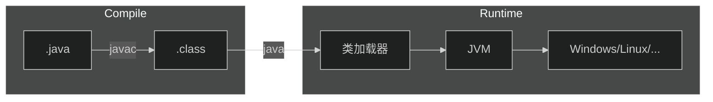
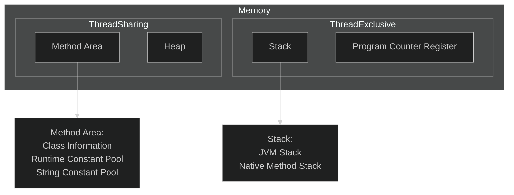

[TOC]

# 1.JavaSE

## 1.JavaSE初步

### 1.什么是Java？

+ Java最初是由Sun公司研发的一款高级语言，Java的底层是由C++来编写的
+ 随后Oracle公司收购了Sun公司，从此Java便开始由Oracle维护


### 2.Java的特性

+ 简单性
    + Java中没有多继承的概念
    + Java屏蔽了指针的概念
    + 所以说Java相对来说是简单的

+ 面向对象
    + Java是纯面向对象的，更符合人的思维模式

+ 可移植性
    + Java代码只需要编译一次就可以在任意的平台上执行
    + Sun公司让Java代码运行在JVM(Java Virtual Machine)--Java虚拟机中，这样就屏蔽了操作系统的不同，对于Java代码来说他们只是在JVM中运行，不需要考虑操作系统的不同
+ 多线程
+ 健壮性
    + Java中有一个垃圾回收机制，Java在运行过程中的垃圾会自动的回收，不用程序员操心


### 3.Java的加载与执行

+ 编译阶段
    + 程序员首先需要创建一个Java源文件
    + Java源文件是以`.java`为结尾的文件
    + 文件中编写的源代码必须是符合Java语言规范的代码
    + 一个Java源文件可以生成一个或者多个`.class`字节码文件
+ 执行阶段
    + 当我们执行运行程序时，JVM会启动类加载器ClassLoader
    + 类加载器会到磁盘上寻找`.class`文件，找到后会将字节码文件装载到JVM当中
    + JVM将字节码文件解释成二进制数据，这样操作系统就会和底层硬件去交互




### 4.Java的安装

+ 要在我们的电脑上编写Java代码，第一件事就是安装JDK
+ 什么是JDK？

    + JDK是`Java Development Kit`--Java语言软件开发包，其中包括了JRE `Java Runtime Environment`--Java运行环境，还有Java自带的一些类库，如`rt.jar`和Java的基础工具`java,javac,jdb...`
+ 什么是JRE？

    + JRE是Java程序运行时必不可少的运行环境，JRE与JDK不同的就是JRE只能供字节码文件运行，不支持Java程序的开发
+ 如何安装Java？

    + 那么现在我们既要编写Java程序，也要运行Java程序，那么我们需要安装的就是JDK了，首先去[Oracle官网](https://www.oracle.com/java/technologies/downloads/)下载JDK
    + 首先选择我们的平台(windows,Linux,...)，然后选择合适的版本，一般来说我们会使用`Java8`和`Java17`，因为这两个版本的Java都是长期支持的版本(LTS)
    + 那这里以Java8在Ubuntu的安装为例，首先下载好Java8的`.tar.gz`文件，解压到桌面后移动到`/usr/local/java`文件夹下
    + 配置环境变量，因为即使你把Java的文件解压出来系统是不会知道你安装了Java的，需要你配置环境变量来告诉系统你安装了Java
    + 打开`terminal`使用命令`sudo vi /etc/profile`，在文件的开头添加下面的内容
    + `export JAVA_HOME=/usr/local/java`
    + `export PATH=$PATH:$JAVA_HOME/bin`
    + `export CLASSPATH=.:$JAVA_HOME/lib/dt.jar:$JAVA_HOME/lib/tools.jar`
    + 添加环境变量后，在终端中输入`java -version`，如果出现了Java的版本信息，那么就算配置成功了


### 5.在IDEA中配置Java环境

+ 在现代的开发工作中，已经不会再使用命令行去开发，一般都会使用集成工作环境去进行项目的管理，常用的IDE工具有IDEA，Eclipse...，但是目前一般都使用IDEA作为集成开发环境
+ 配置Java环境
    + 在IDEA中打开File-->Project Structure-->Project，在SDK中选择我们安装Java的目录，在下面出现版本信息后，就说明引入成功了


### 6.第一个Java程序

+ 在IDEA中新建一个Project，在src目录下新建Java源文件，并输入下面的内容

    + ```java
        public class Main {
            public static void main(String[] args){
                System.out.println("hello world!");
            }
        }
        ```

+ 点击右上角的`▶`，运行当前的程序

+ 在下面控制台中出现了`hello world!`的字样，表示我们的程序运行成功了


### 7.Java注释

+ 在Java中，我们可以编写注释，注释可以让我们程序的可读性大大提高，当代码量极大时，编写注释是必须的
+ 如何编写注释？
    + 使用`//`来表示单行注释，在这一行中编写的任何内容都不会作为源代码编译
    + 使用`/** */`来进行多行注释，在这些行中的编写的内容会有一个格式规范，因为这样的注解可以通过`JavaDoc`生成帮助文档


## 2.JavaSE基础

### 1.Java中类的概念

+ 因为Java是一门面向对象的语言，所以Java中有一个叫做类的概念，所有的源代码都需要编写在类中
+ 类是什么？
    + 当Java程序员对现实世界进行观察，将一些物体的特征提取出来，所有的物体都有这个特征，那么这个提取出来的集合就变成了类`class`
+ 什么是对象？
    + 当我们想要用一个类去表达一个物体时，我们就需要用类去描述这个物体，拥有具体描述的类就变成了对象`object`


### 2.类的编写

+ 假如我们创建了一个Java源文件叫做`Hello.java`，那么在这个类中的公共类必须叫做`Hello`，这是什么意思呢？

    + ```java
        //Hello.java
        public class Hello {
            
        }
        ```

+ 跟在`class`后面的标识符就是`类名`，一个Java源文件中只能有一个公共类，这是什么意思？

    + 从上面的例子我们可以知道，`class`的前面还要有`public`，一个类中只能有一个由`public`修饰的类
    + 如果想编写更多的类，就只能写`class 类名`，但是在实际的开发中，我们一般一个源文件只编写一个类

+ 在[上文](#3.Java的加载与执行)中我们提到，一个源文件可以编译生成一个或者多个字节码文件，这是什么意思？

    + 其实每个字节码文件`.class`都对应一个类，当我们在一个源文件中编写多个类时，就会生成多个字节码文件


### 3.标识符

+ 在Java中，凡是能让我们自己命名的东西，都叫做`标识符`
+ 比如类名，变量名，方法名，接口名...
+ 标识符的命名规范
    + 标识符是只能由字母，数字，下划线，美元符号构成的
    + 必须以字母，下划线或者美元符号开始，不能以数字开始
    + 关键字不能作为标识符
+ 在开发中的标识符命名规范
    + 标识符一般遵循驼峰命名规范，即每个单词的首字母大写，如`HelloTest,actNo`
    + 类名第一个单词首字母大写
    + 方法名，变量名第一个单词小写
    + 常量名，每个字母都是大写，单词之间使用`_`隔开


### 4.数据类型

+ Java中总的来说有两种数据类型，基本数据类型和引用数据类型
+ 基本数据类型
    + 数值型byte,short,int,long,float,double
    + 字符型char
    + 布尔型boolean
+ 引用数据类型
    + 数组
    + 类
    + 接口


### 5.变量

+ 变量是Java中最基本的单元
+ 变量的定义
    + [修饰词] 变量类型 标识符 = 值/null;
    + [修饰词] 变量类型 标识符;
+ 在类体中定义的变量叫做`属性`


### 6.运算符

Java中的运算符基本与C++一致，但是还有一些运算符可以补充

+ instanceof运算符
    + 这个运算符是可以用来判断一个实例到底是什么类的实例，假设有一个实例`b`，它的类型是`B`，那么`b instanceof B`是返回`true`的，而且对于`B`的所有父类都会返回`true`

### 7.控制语句

Java中的控制语句基本与C++一致


### 8.方法

+ Java中的方法其实相当于C++中的函数
+ Java中定义方法
    + [修饰词] 返回值类型 方法名 (参数列表){}
+ 方法的重载
    + 什么是方法的重载(Overload)？
        + 当我们需要一个方法提供不同的功能时，可以通过改变参数列表和返回值来实现
    + 怎么实现方法的重载？
        + `方法名相同`
        + 方法的参数类型，个数，顺序，这三者至少有一者不同
        + 方法的返回类型不同（不以返回类型来区分方法的重载）
        + 方法的修饰符可以同
        + `方法的重载只出现在一个类中`
+ 方法的覆盖
    + 什么是方法的覆盖(Override)？
        + 当我们的类继承父类时会继承父类的方法，当父类的方法无法满足我们的需求时，需要覆盖/重写父类的方法
    + 怎么实现方法的覆盖？
        + `需要继承一个父类`
        + `只能改变参数的标识符和方法体，其他东西不能改变`
+ 方法的实现
    + 什么是方法的实现？
        + 当我们的类继承了一个抽象类或者实现了多个接口，我们需要对里面的方法进行实现


### 9.类的运行

+ 当我们想要运行一个类时，类中必须要有`main`方法，主方法的编写是固定的模式，不要进行修改

    + ```java
        public static void main(String[] args){
        	//方法体        
        }
        ```

+ 除了变量的定义之外，所有的运行语句都需要放在方法中


### 10.数组

数组与C++相似但也有不同之处

+ 定义一个数组，语法与C++略有不同

    ```java
    int[] a = new int[10];//创建容量为10的数组
    Object[] a = {obj1,obj2,obj3,...};//创建并初始化数组
    ```

+ 数组自带一个属性`.length`，我们可以通过这属性直接获得数组的长度，即数组的容量

+ 数组的多态

    + 我们都知道Java是一门面向对象的语言，所以可以使用父类型的数组来存储子类型的对象，这是`数组的多态`，
    + 但是，当我们使用父类型数组储存子类型对象时无法直接调用子类型的方法，因为编译器认为这个数组存储的类型就是我们定义数组时的类型，所以想要调用子类型的方法时，就要对类型进行强转

---

## 3.JavaSE面向对象

### 1.面向对象和面向过程

+ 为什么会出现面向对象的分析方法？
    + 现实世界太复杂多变，面向过程的分析方法无法满足现有需求
+ 面向过程
    + 采用面向过程必须了解整个过程，每个步骤都有因果关系，每个因果关系都构成了一个步骤，多个步骤就构成了一个系统，因为存在因果关系每个步骤很难分离，非常紧密，当任何一步骤出现问题，将会影响到所有的系统。如：采用面向过程生产电脑，那么他不会分 CPU、主板和硬盘，它会按照电脑的工作流程一次成型
+ 面向对象
    + 面向对象对会将现实世界分割成不同的单元（对象），实现各个对象，如果完成某个功能，只需要将各个对象协作起来就可以


### 2.面向对象三大特性

+ 封装
+ 继承
+ 多态


### 3.类与对象的概念

在[Java中类的概念](#1.Java中类的概念)后补充

+ 类是对具有共性事物的抽象描述，是在概念上的一个定义，那么如何发现类呢？

    + 通常根据名词(概念)来发现类，如在成绩管理系统中：学生、班级、课程、成绩
    + 学生1（张三，502，Java，98）
    + 以上学生1包含的内容是具体存在的，称为对象(Object)，也叫实例(instance)，也就是说一个类的具体化就是对象或实例

+ 为什么面向对象能成为主流的技术？

    + 因为面向对象的思想更符合人的思维模式，更容易分析现实世界

+ 采用面向对象的技术的程序设计可以分为三个阶段

    + OOA（面向对象的分析）
    + OOD（面向对象的设计）
    + OOP（面向对象的编程）---Java就是一门纯面向对象的语言

+ 继续上面的例子，我们可以进一步展开

    + 学生：姓名，性别，班级，学号，成绩
    + 班级：班别，班号，地址
    + 成绩：学科代码，成绩

+ 这些分析出来的东西，都叫做`属性`，下面通过一个类图来演示一下

+ ```mermaid
    classDiagram
    class Student{
    	-String name
    	-boolean gender
    	-String classNo
    	-String sNo
    	-List~Grade~ grades
    	+getName()
    	+getGender()
    	+getClassNo()
    	+getGrades()
    	
    }
    
    class Class{
    	-List~Student~ students
    	
    }
    
    class Grade{
    	-String projectId
    	-double credit
    	+getProjectId()
    	+getCredit()
    }
    
    Class --> Student
    Student --> Grade
    ```

+ 通过上面的图我们可以了解，`类 = 属性 + 方法`


### 4.类的定义

在[类的编写](#2.类的编写)后补充

+ Java中如何去定义类？

    + [修饰符] class 类名 `extends 父类 implements 接口`{}

    + ```java
        public class Student {
            private String name;
            private boolean gender;
            private String sNo;
        
            public String getName() {
                return name;
            }
        
            public void setName(String name) {
                this.name = name;
            }
        
            public boolean isGender() {
                return gender;
            }
        
            public void setGender(boolean gender) {
                this.gender = gender;
            }
        
            public String getsNo() {
                return sNo;
            }
        
            public void setsNo(String sNo) {
                this.sNo = sNo;
            }
        
            public Main() {
            }
        
            public Main(String name, boolean gender, String sNo) {
                this.name = name;
                this.gender = gender;
                this.sNo = sNo;
            }
        }
        ```


### 5.类中的变量

在[变量](#5.变量)后补充

+ 类中的变量分为两种，一种是成员变量，一种是局部变量
+ 成员变量
    + `成员变量是定义在类体中的`
    + `成员变量只属于当前(this)的对象，不属于类`
    + `成员变量只能通过对象访问`
    + 定义格式为：[修饰符] 变量类型 标识符 `= 值/null`
    + 在定义时可以不进行初始化，因为在实例创建时会默认初始化
+ 局部变量
    + `局部变量定义在方法体内`
    + 定义格式为：变量类型 标识符 = 值
    + 局部变量在定义时必须初始化


### 6.对象的创建和使用

+ 对象必须创建(new)出来才可以使用

+ 创建对象也像创建变量一样，格式是相似的

    + ```java
        public static void main(String[] args) {
            Student student = new Student();
        }
        ```

+ 访问成员变量

    + 当我们的成员变量是以`public`修饰时，可以直接通过`.`的方式访问

        + ```java
            public static void main(String[] args) {
                Student student = new Student();
                s.name = "zhangsan";
                String s = student.name;   
            }
            ```

    + 但是一般来说，在实际开发中，为了类的安全和稳定，都会将类进行`封装`，即把成员变量都用`private`修饰，对成员变量的访问都通过`set,get`方法进行访问，这就是`封装属性，暴露方法`

        + ```java
            public static void main(String[] args) {
                Student student = new Student();
                s.setName("zhangsan");
                String s = student.getName();
            }
            ```

+ 调用实例方法

    + 在类中，没有使用`static abstract`修饰的方法就是实例方法

    + 实例方法需在`main`方法中调用，调用格式为`实例.方法名(参数列表)`

    + ```java
        public static void main(String[] args) {
            Student student = new Student();
            s.setName("zhangsan");
            String s = student.getName();
        }
        ```


### 7.构造器

+ 构造器的主要作用是用来创建实例，并且在创建实例时初始化成员变量

+ 构造器的声明格式：[修饰符] 类名(){}

+ 需要注意的点：

    + 构造器没有返回值，也不能加`void`，加了就变成了普通方法
    + 构造器的名字必须和类名一致
    + 构造器的参数是不定的，如果我们没有设置参数或者没有编写构造器，那么会默认存在一个无参的构造器
    + 如果我们创建了一个有参的构造器，那么默认的无参构造器就不会存在，我们必须编写无参的构造器
    + 构造器可以[重载](#8.方法)，重载的规则与方法重载的规则相同

+ 例子

    + ```java
        //class Student
        public Student() {}
        
        public Student(String name, boolean gender, String sNo) {
            this.name = name;
            this.gender = gender;
            this.sNo = sNo;
        }
        ```

+ 补充的点

    + 工具类的构造方法一般都是以`private`修饰的，因为工具类不需要创建实例


### 8.Java中的内存管理

Java内存的主要划分如下

+ 栈区
  + 本地方法栈
  + JVM栈

+ 堆区
+ 方法区
+ 程序计数器



`线程私有的`

+ 程序计数器

  + 程序计数器是JVM的一部分，它是一个寄存器，用于存储当前线程执行的字节码指令的地址

  + 程序计数器的作用：
      + 他是一个计数器，用来记录当前线程执行的字节码指令的地址
      + 用于判断方法的执行是否已经完成，如果完成了则返回调用方法的地方

+ 本地方法栈

  + 我们都知道，Java的底层是由C++编写的，一切Java代码的执行其实都依赖于C++的底层代码，而本地方法（native）就是由C++编写的方法

  + 本地方法栈的作用：
    + 用于储存JVM所需的本地方法，保存本地方法的运行环境

+ JVM栈

  + JVM栈是JVM的一部分，是方法执行的内存模型，它维护了一组栈帧，每个帧对应一个方法调用

  + JVM栈是JVM中非常重要的内存区域
  + JVM栈的作用：
    + 保存局部变量表：局部变量表中存储着方法执行期间的局部变量
    + 保存操作数栈：操作数栈存储着方法执行期间的操作数
    + 保存方法调用：方法调用是虚拟机栈的核心，每次方法调用，虚拟机栈都会加入一个帧，保存调用信息

  + 如果方法执行次数过多，JVM会抛出StackOverflow异常


`线程共享的`

+ 堆
  + 存储了所有new出来的对象，是线程共享的一块区域

+ 方法区
  + 方法区是JVM内存中的一块区域，主要存储Class对象，常量，静态域，类型数据等信息
    + Class对象：储存类的元数据类型，如类名，访问权限，父类，方法，字段等信息
    + 常量：储存编译时期的常量值，如字符串常量，数字常量等
    + 静态域：储存类的静态成员变量和静态成员方法
    + 类型信息：储存类的类型信息，例如描述符，类加载器等
    + 字节码：储存字节码，供类加载器使用


### 9.传入变量的方式

在[变量](#5.变量)后补充

+ 在Java中，所有的传参都是传参，但是基本数据类型和引用数据类型传参时还是有一定的区别
+ 基本数据类型
    + 与C++类似，创建了一个新的变量来接收传入的值


+ 引用数据类型
    + 在实际的使用中，我们都知道方法可以传入一个对象来调用对象的方法来对对象进行修改，尽管看起来像是传入了一个对象（引用），但是实际上是创建了一个新的引用指向传入的对象


### 10.this关键字

+ 在Java中this关键字指的是`当前调用的对象`

+ this的使用

    + 当局部变量和成员变量重名时可以使用this表示成员变量
    + 可以使用this来调用构造器

+ 需要注意的点

    + this只能用在构造函数和成员方法内部

        + ```java
            public void setName(String name) {
                this.name = name;
            }
            
            public Student(String name, boolean gender, String sNo) {
                this.name = name;
                this.gender = gender;
                this.sNo = sNo;
            }
            ```

    + this调用构造器时，this只能写在第一句

        + ```java
            public Student(String name, boolean gender) {
             	this(name,gender,0)   
            }
            ```


### 11.static关键字

+ static关键字可以修饰变量，类，方法，代码块

在[变量](#5.变量)后补充

使用static修饰的变量称为静态变量，否则叫做实例变量

+ 静态变量
    + `静态变量是属于类的`，这意味着所有的实例共享一个静态变量
    + 类中的静态变量在类加载时就会被存放到静态域中，并且只有一个
    + 我们只能通过`类名.静态变量名`来访问静态变量
+ 实例变量
    + 实例变量是属于实例的，意味着每个实例都对自己的变量有自己的描述
    + 实例变量只有在创建实例时才会创建，实例变量随实例存储在堆区中
    + 封装后只能通过set和get方法取得

在[方法](#8.方法)后补充

使用static修饰的方法叫做静态方法，否则就做实例方法

+ 静态方法
    + `静态方法是属于类的`
    + 静态方法只能使用`类名.方法名()`调用
    + `静态方法不能直接调用实例变量和实例方法`
+ 实例方法
    + 实例方法是属于实例的
    + 实例方法只能使用`实例名.方法名()`调用

静态代码块

+ 使用static修饰的代码块叫做静态代码块
+ 静态代码块在类加载的时候执行，并且只会执行一次
+ 静态代码块定义于类体中

值得注意的是

+ 很多工具类中会将构造器使用`private`修饰，并且类中只有静态常量和静态方法


### 12.类的继承

继承是面向对象三大特性之一

+ 什么是继承？

    + Java中的继承与现实中的继承是一样的，假如说A继承了B，那么A就会拥有B所拥有的东西

+ Java中的继承

    + Java中只支持类的单继承，也就是说一个类只能继承一个类，使用关键字`extends`实现

    + 语法格式：[修饰符] class 子类名 extends 父类名

    + ```java
        public class A extends B{}
        ```

    + A继承B后，A就会拥有B的属性和方法
    
    + 所有的类默认继承`Object`类，即`Object`是所有类的超类

在[方法](#8.方法)后补充

+ 方法的覆盖
    + 什么是方法的覆盖(Override)？
        + 当我们的类继承父类时会继承父类的方法，当父类的方法无法满足我们的需求时，需要覆盖/重写父类的方法
    + 怎么实现方法的覆盖？
        + `需要继承一个父类`
        + `只能覆盖实例方法`
        + `只能改变参数的标识符和方法体，其他东西不能改变`
        + 子类方法的访问权限不能小于父类方法的访问权限
        + 子类方法不能抛出比父类方法更多的异常，子类方法能抛出父类方法异常的子异常
        + 父类的静态方法不能被修改
        + 父类的私有方法不能被覆盖


### 13.super关键字

+ Java中super关键字指的是`父类`

+ super关键字的作用
    + 调用父类方法，构造器
    + `调用接口的默认方法`
    
+ super关键字的使用
    + 在实例方法中调用父类方法
    + 在构造器中调用父类构造器
    
+ 使用时需注意
    + 当父类中没有无参构造，我们在子类中使用了无参构造会报错，因为子类的无参构造会调用父类的无参构造方法
    
    + 调用接口的默认方法的代码比较特殊
    
        ```java
        interface A{
            default String print(){
                return "A";
            }
        }
        
        public class B implements A{
            public String print(){
                return A.super.print();
            }
        }
        ```
    
        


### 14.final关键字

+ final表示不可改变的含义
+ 使用final修饰的类`不能被继承`
+ 采用final修饰的方法`不能被覆盖`
+ 采用final修饰的变量`不能被修改`
+ final修饰的变量必须先初始化
+ final修饰的引用只能指向一个对象，但是这个对象的内容是可以被修改的


### 15.abstract关键字

+ abstract在Java中是抽象的意思
+ 使用abstract修饰的方法叫做抽象方法，修饰的类叫做抽象类
+ 抽象类
  + 抽象类的定义：[修饰符] abstract class 类名 {}
  + `抽象类不能被实例化`
  + 抽象类不能被final修饰
  + 抽象类中可以没有抽象方法
  + 抽象类中可以有实例方法

+ 抽象方法
  + 抽象方法的定义：[修饰符] abstract 返回类型 方法名();
  + 抽象方法不能写方法体，只能以`;`结尾
  + 被继承的父类抽象方法，要么就在子类中实现，要么就再次定义为抽象方法
  + 抽象方法不能使用final修饰


### 16.接口类

接口的概述

+ 接口可以说是一种更特殊的抽象类，因为他比抽象类更加严格，接口中只能存在常量和抽象方法
+ 接口的定义：[修饰符] interface 接口名{}
+ 接口的使用
  + 接口可以`继承(extends)`多个接口
  + 一个类可以`实现(implements)`多个接口
  + `接口不能被实例化`
  + 接口中的变量默认被`public static final`修饰且不能更改，所以接口中的常量是这样定义的：类型 常量名 = 值
  + 接口中的方法默认被`public abstract`修饰且不能更改，所以接口中的方法的定义为：返回类型 方法名();
+ 使用接口的好处
  1. 抽象性：接口是一种抽象数据类型，可以定义方法的签名而不提供实现，使程序员可以更好地抽象和理解程序的设计。
  2. 多态性：通过实现接口，一个类可以拥有多种类型，这就是多态性。
  3. 灵活性：接口是独立于实现者的，因此在不影响已有代码的情况下可以对接口进行更改。
  4. 结构性：接口可以使用继承机制与其他接口进行组合，从而使代码更加结构化。
  5. 可重用性：一个类可以实现多个接口，从而实现多种功能，提高代码的可重用性。
+ 多态
  + 多态的条件是，有实现或继承，有方法覆盖或者实现，父类对象引用指向子类对象，即使用一个接口引用子类对象
+ 在以后的开发中要注意的是
  + 面向接口(抽象)编程，而不要面向具体过程编程，这样才能提高代码的可拓展性
  + 虽然抽象类和接口类很像，但是尽量选择接口


只有一个抽象方法的接口称为函数式接口


默认方法

+ 可以为接口方法提供一个默认实现，必须使用`default`修饰这样的方法
+ 默认方法一个重要的作用是`接口演化`，假设很久以前我们提供了一个类`B`实现了一个接口`A`，此时的接口A是1.0版本，但是当A升级为2.0版本并添加了新的方法时，如果我们直接套用以前的代码将无法编译，如果提供了默认方法，则又可以继续编译了


解决方法冲突

+ 当一个类及继承了两个有同名方法的接口时，会发生冲突，无论是否提供了默认方法，程序员都必须在类中覆盖这个方法
+ 还有一种情况，当一个类继承了一个超类同时实现了一个接口，他们两个存在同名方法时，也会发生冲突，但是此时只会考虑超类方法，这就是`类优先原则`


在Java8中，允许在接口中添加静态方法，虽然是合法的，但是这有违接口作为抽象的规范的初衷


### 17.访问控制权限

+ 在Java中有四种访问控制权限，分别是`public,protected,缺省(default),private`，从命名上就可以看出，他们的安全级别大小
+ 注意对类的修饰只有`public,default`，内部类除外
+ 下面给出访问控制权限的表格帮助理解

|          | public | protected | default | private |
| :------: | :----: | :-------: | :-----: | :-----: |
| 任意位置 |   Y    |     N     |    N    |    N    |
|   同包   |   Y    |     Y     |    N    |    N    |
|   子类   |   Y    |     Y     |    Y    |    N    |
|  类内部  |   Y    |     Y     |    Y    |    Y    |


### 18.Object类中三大经典方法

Java中有三个经典的方法，几乎是每个类都需要进行重写，我们知道在Java中Object类是所有类的超类，所以所有的类都会有下面的方法


equals方法

+ equals方法在Object类中编写，所有的类都会继承这个方法，所以在编写类的时候，我们要将这个方法进行覆盖以适应新的要求

+ 重写equals方法时有一定规范，Java语言规范中对它有这样下面的要求

    + 自反性
    + 对称性
    + 传递性
    + 一致性
    + 对于任意的非空引用x，调用`x.equals(null)`应该返回`false`

+ 下面给出一个编写完美的equals方法的建议：

    + 显示参数命名为`otherObject`

    + 检测this与otherObject是否相等（内存地址一致）

    + 检测otherObject是否为空

    + 比较this与otherObject的类

        + 如果equals的语义可以在子类中改变，使用getClass检测
        + 如果所有的子类都有相同的相等性语义，可以使用instanceof检测

    + 将otherObject强转为相应类型的变量

    + 然后根据相等性概念的要求来比较字段，使用`==`比较基本类型字段，使用`equals`来比较引用类型字段

        ```java
        @Override
        public boolean equals(Object otherObject){
            if(this == otherObject)return true;
            if(this == null)return false;
            //语义可以在子类中改变
            if(getClass() != otherObject.getClass())return false;
            //所有的子类都有相同的相等性语义
            if(!(otherObject instanceof ClassName))return false;
            ClassName other = (ClassName) otherObject;
            return field1 == other.getField1() ...
        }
        ```


hashCode方法

+ hashCode方法同样在Object类中就已经编写，用于返回一个对象的哈希值（整型），所以每个对象都有一个固定的哈希值，值是由对象的内存地址得出的
+ 如果重写了equals方法，那么我们同样要重写hashCode方法，而且equals与hashCode的定义必须相容，也就说，如果`x.equals(y)`返回true，那么`x.hashCode()与y.hashCode()`必须返回相同的值


toString方法

+ toString方法的目的是返回一个描述对象的字符串，我们先来看看在Object类中的定义

    ```java
    public String toString() {
        return getClass().getName() + "@" + Integer.toHexString(hashCode());
    }
    ```

    非常的简短，但是在日常的使用中却十分有效，它返回的字符串为`类名@内存地址的十六进制字符串`，在日常的使用中用以区分对象已经十分够用，但是若用以打印类中的内容时，就不是那么够看了

+ 重写toString方法，一般来说，会将对象中的所有字段打印出来，所有字段都用`[]|{}`括起来，每个字段使用`,`分开


### 19.其他一些方法

clone方法

---


## 4.JavaSE进阶

### 1.String

+ String类位于java.lang.String，是Java中最常用的类之一
+ `Java中的字符串不能拼接`，这句话的意思是，当我们创建了一个字符串对象，那么这个字符串对象就不能再改变，不是说字符串的引用不能改变
+ 常用构造器
    + String(byte[] bytes)
    + String(byte[] bytes, int offset, int length)
    + String(char[] value)
    + String(char[] value, int offset, int length)
    + String(String original)
+ 常用方法
    + charAt(int index)
    + compareTo(String anotherString)
    + compareToIgnoreCase(String anotherString)
    + contains(CharSequence s)
    + getBytes()
    + indexOf()
    + isEmpty()
    + lastIndexOf()
    + length()
    + replace()
    + spilt()
    + toCharArray()
    + trim()
    + valueOf()
    + subString()


### 2.StringBuffer和StringBuilder

+ 为了解决字符串的拼接问题，Java中内置了两个类一个是StringBuilder，一个是StringBuffer，他们两个有几乎相同的方法，唯一不同的是，StringBuffer中的方法都使用了`synchronized`关键字修饰，这代表它是线程安全的，所以效率相较于StringBuilder会比较低
+ 常用构造器
    + StringBuffer()
    + StringBuffer(int capacity)
+ 常用方法
    + append()
    + insert()
    + delete()
    + replace()
    + reverse()


### 3.Random

+ Random类java.util.Random，顾名思义，就是Java中内置的随机库，我们可以用来产生随机数
+ 常用构造器
    + Random()
+ 常用方法
    + nextInt()
    + nextLong()
    + nextDouble()


### 4.Arrays

+ Arrays类java.util.Arrays，Java内置的数组工具类
+ 常用方法
    + sort()
        + 使用sort方法的类必须实现Comparable接口
    + binarySearch()


### 5.BigDecimal

+ BigDecimal类java.math.BigDecimal，大数类，精度远高于基本数据类型double
+ `在银行，金融等对精度要求较高的系统，都会使用BigDecimal类存储数字`
+ 常用构造器
    + BigDecimal()
+ 常用方法
    + abs()
    + add()
    + divide()
    + pow()
    + max()
    + min()
    + subtract()
    + multiply()


### 6.DecimalFormat

+ DecimalFormat类java.text.DecimalFormat，专门负责数字的格式化输出，可以让数字按照自己想要的格式输出
+ 常用构造器
    + DecimalFormat(String pattern)
+ 常用方法
    + format()


### 7.Date

+ Date类java.util.Date，在Java中我们可以用Date类来构建时间的显示
+ 常用构造器
    + Date(long date)


### 8.SimpleDateFormat

+ SimpleDateFormat类java.text.SimpleDateFormat，Java中将日期格式化输出的类
+ 常用构造器
    + SimpleDateFormat(String pattern)
+ 常用方法
    + format()
    + parse()


### 9.Collections

+ Java中内置了多种数据结构，常用的数据结构就包括以下几种
    + Set
        + HashSet
        + TreeSet
    + Map
        + HashMap
        + TreeMap
        + Properties
    + ArrayList
    + Hashtable


+ 容器间的实现关系


Set

+ HashSet
    + HashSet这个类实现了Set接口，是由Hashtable支持的（实际上是一个HashMap的实例），它不能保证元素的遍历顺序，尤其是不能保证元素的顺序不随时间变化保持不变，允许存在`null`值
    
    + `当哈希函数能正确的将元素分散在桶中时`，set的基础操作（add,contains,remove,size）能提供恒定的时间性能，即恒定的时间复杂度
    
    + 注意，Set并不是线程安全的，意味着当多线程对Set进行操作时，可能会引发线程安全问题，如果一定要使用Set，我们把Set包装起来，使用下面的代码
    
        ```java
        Set s = Collections.synchronizedSet(new HashSet());
        ```
    
    + 常用构造器
    
        + HashSet()
    
    + 常用方法
    
        + add()
        + clear()
        + remove()
        + size()
    
+ TreeSet

    + TreeSet除了实现Set接口还实现了SortedSet接口，TreeSet的是通过TreeMap实现的，TreeSet具有对元素的自定义排序功能，使用TreeSet放置的元素必须`实现Comparable接口`，`或者使用Comparator作为构造器的参数`，这取决于他们使用的是哪个构造器

    + 但是实际上，TreeSet执行两个元素的比较是使用它的`compare`或者`compareTo`方法，虽然从Set的角度来说，他们是相等的，但是可能会与`equals`方法不一致，即使存在这种行为，但是Set仍然是被良好定义的，它只是不遵守Set接口的一般约定

    + 与HashSet一致，TreeSet也是线程不安全的，想要线程安全，我们同样要将Set包装起来

        ```java
        SortedSet s = Collections.synchronizedSortedSet(new TreeSet());
        ```

    + 常用构造器

        + TreeSet()
        + TreeSet(Comparator comparator)

    + 常用方法

        + add()
        + remove()
        + contains()
        + size()
        + clear()
        + first()
        + last()


​    

List

+ ArrayList

    + 可调整大小的数组，他实现了List接口，类中提供了多种可选择的列表操作，能存储多种元素，包括`null`，提供了调整内部存储列表的数组的大小的方法

    + ArrayList大致与Vector相当，只是ArrayList不是线程同步的，在实际使用中还是ArrayList较多

    + ArrayList添加一个元素需要$O(n)$的时间，所有其他的操作只需要线性的时间

    + ArrayList创建时的默认容量为10，随着元素的添加容量会自动的调整，当容量不足时，会创建一个新的ArrayList容量为旧容器容量的1.5倍，然后把原来的元素复制到新的容器中，这个操作十分耗时，所以在确定的应用场景下，最好预先分配足够的容量

    + ArrayList是线程不安全的，同样可以把他包装起来

        ```java
        List list = Collections.synchronizedList(new ArrayList<>());
        ```

    + 常用构造器

        + ArrayList()
        + ArrayList(int capacity)

    + 常用方法

        + add()
        + get()
        + clear()
        + indexOf()
        + remove()
        + set()
        + toArray()


Map

+ HashMap

    + HashMap实现了Map接口，提供了所有可选择的Map操作，允许key为空，value为空（HashMap与Hashtable大致相似，只是它不是同步的同时允许空值）

    + 在哈希函数正确的将元素分散在桶中的前提下，他提供的操作有常数时间的性能

    + 对集合视图进行遍历所需的时间与map实例的大小（桶的数量）加上他的大小（key-value）成正比，如果遍历map的性能非常重要，不要把map的容量设置太大

    + 它的默认容量为16，自定义的初始化容量必须为2的倍数，默认的加载因子为0.75，这意味着当map的容量到达最大容量的75%时，map会自动的扩大容量

    + `JDK8的新特性`：map实际上是一个个哈希桶，首先通过`hashCode`方法来比较每个节点的哈希值，值相同的情况下就会放入一个桶中，但是当桶中的元素过多时，为了提高效率，桶中的元素会变成二叉树的形式，当一个桶中的元素超过8个时就会变成二叉树，树中的节点少于6个时，又会退化成桶，值得一提的是，当程序员使用定义良好的`hashCode`方法时，二叉树会很少用到

    + HashMap是非同步的，同样可以使用集合工具类进行包装

        ```java
        Map map = Collections.synchronizeMap(new HashMap<>());
        ```

    + 常用构造器

        + HashMap()

    + 常用方法

        + clear()
        + entrySet()
        + put()
        + get()
        + remove()
        + replace()
        + size()

+ TreeMap

    + 基于红黑树实现的map，同样是通过Comparable，或者Comparator来实现对元素的排序

    + 他的所有操作的时间复杂度都是$O(logn)$

    + TreeMap也是非同步的，可以使用集合类工具进行包装

        ```java
        SortedMap map = Collections.synchronizeSortedMap(new TreeMap<>());
        ```

    + 使用与HashMap差不多


对于集合类的补充：

+ 使用Set和Map类集合时，一定要重写`hashCode`和`equals`方法，而且使用IDEA去自动生成


### 10.包装类

+ Java中除了基本数据类型，还提供了基本数据类型的包装类，包装类名就是基本数据类型的首字母大写(int->Integer,double->Double)
+ 包装类可以进行自动装箱与自动拆箱，与直接使用基本数据类型相似，实际上自动装箱和自动拆箱都是在编译时就完成了，并不是由JVM负责，比如当我们把一个基本数据类型赋值给包装类时，其实是调用了`valueOf`方法，拆箱时则是`get`方法，这些语句在编译时就会被翻译为字节码
+ 即使是包装类的判断是否相同也要使用`equals`方法


### 11.泛型

+ 在集合类中我们已经遇到了很多的泛型容器，他们后面有一个尖括号，专门用来指定容器中的元素类型


### 12.输入输出流

流在Java中负责了文件的读取与写入，是Java与系统交互中十分重要的一环，根据流的类型可以有两种分类：

+ 根据在内存中的方向
    + 往内存中写：Input/Read
    + 从内存往外写：Output/Write
+ 根据读取文件的方式
    + 字节流，一次读取一个字节，可以读取所有种类的文件
    + 字符流，一次读取一个字符，只能读取纯文本类型的文件


我们主要就学习下面的流

+ java.io.FileInputStream/java.io.FileOutputStream
+ java.io.FileReader/java.io.FileWriter
+ java.io.ObjectInputStream/java.io.ObjectOutputStream
+ java.io.PrintStream


使用流时需要注意的点

+ 使用输出流时，在最后一定要使用`flush`方法，否则可能会导致输出数据丢失
+ 使用完流后，一定要将流关闭

### 13.序列化

当我们想要把内存中的Java对象保存到本地磁盘中，就需要使用到序列化，将对象写入到磁盘中叫做序列化，从磁盘写入内存则叫做反序列化，进行序列化操作时，我们会需要下面两种流以及实现`Serializable`接口

+ ObjectInputStream
+ ObjectOutputStream


进行序列化操作时的注意事项

+ 序列化操作其实是将一个类中的字段全部写入到磁盘中，当我们有一些字段不想写入到磁盘中时，可以使用`transient`来修饰字段，这样这个字段在序列化时就会被忽略

+ JVM是通过一个`序列化UID`来识别类的，假如说我们修改一个已经序列化的类中的方法，那么很可能我们无法将序列化的数据反序列化，此时的解决方法就是我们手动设置一个固定的UID给这个类

  ```java
  public static final long serialVersionUID = 1L;
  ```

  需要注意的是，这个序列号最好是全球唯一，可以用IDEA生成，也可以给一个简单的值


### 14.反射机制

反射机制是Java中十分重要的特性，


### 15.异常类

在实际的开发中，为了判断到底是哪里发生了异常，一般我们会自己定义一些异常来帮助我们进行判断


### 16.lambda表达式

Java8中引入了一个新特性--lambda表达式，在某些问题的处理上，使用lambda表达式会让我们的代码看上去更简洁，效率更高

lambda表达式是什么？

+ lambda表达式是一个代码块和传入代码的变量规范


lambda语法

+ 使用`()`括起来的参数列表，当只有一个参数时可以省略

+ `->`指向代码块，位于`()`后

+ 使用`{}`括起来的代码块，只有一句时可以省略

    

方法引用

有时，lambda表达式涉及一个方法，假设我们希望只要一出现定时器事件就打印事件对象，可以有下面两种写法

```java
var timer = new Timer(1000, event -> System.out.println(event));
var timer = new Timer(1000, System.out::println)
```

`System.out::println`是一个`方法引用`，它指示编译器生成一个函数式接口的实例，覆盖这个接口的抽象方法来调用给定的方法，在上面的例子中，会生成一个ActionListener，他的`actionPerformed(ActionEvent e)`方法要调用`System.out.println(e)`

再来看一个例子，假设我们想要对字符串进行排序，不考虑大小写，可以像下面这么写

```java
Arrays.sort(strings, String::compareToIgnoreCase)
```

从上面的例子可以看出，方法引用有下面几种情况：

+ `object::instanceMethod`
    + 这种情况相当于向方法传递参数的lambda表达式，对于`System.out::println`，对象是`System.out`，等价于`x->System.out.print(x)`
+ `Class::instanceMethod`
    + 在这种情况下，第一个参数就会变成隐式参数，对于`String::compareToIgnoreCase`，等价于`(x,y)->x.compareToIgnorCase(y)`
+ `Class::staticMethod`
    + 这种情况下，所有的参数都会传递到静态方法，`Math::pow(x,y)`等价于`(x,y)->Math.pow(x,y)`


传递到函数式接口

我们知道，只有一个抽象方法的接口叫做函数式接口，那么怎么把lambda表达式传递到函数式接口呢？看下面的例子，我们想要重复一个动作10次，提供了一个repeat方法

```java
public static void repeat(Runnable action) {
    for (int i = 0; i < 10; i++) action.run();
}

public static void main(String[] args){
    repeat(()-> System.out.println("hello lambda"));
}
```

我们使用了一个函数式接口来接收表达式，调用`action.run()`时会执行表达式的主体

