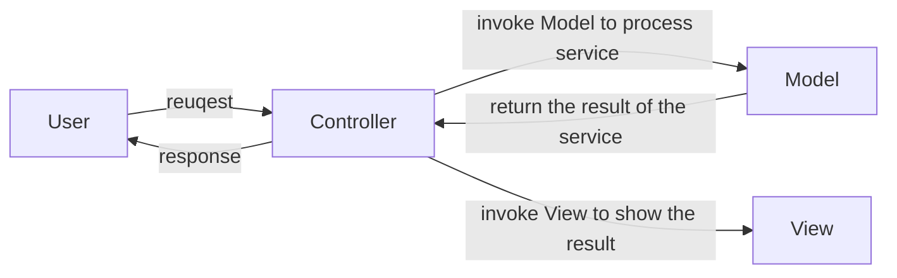
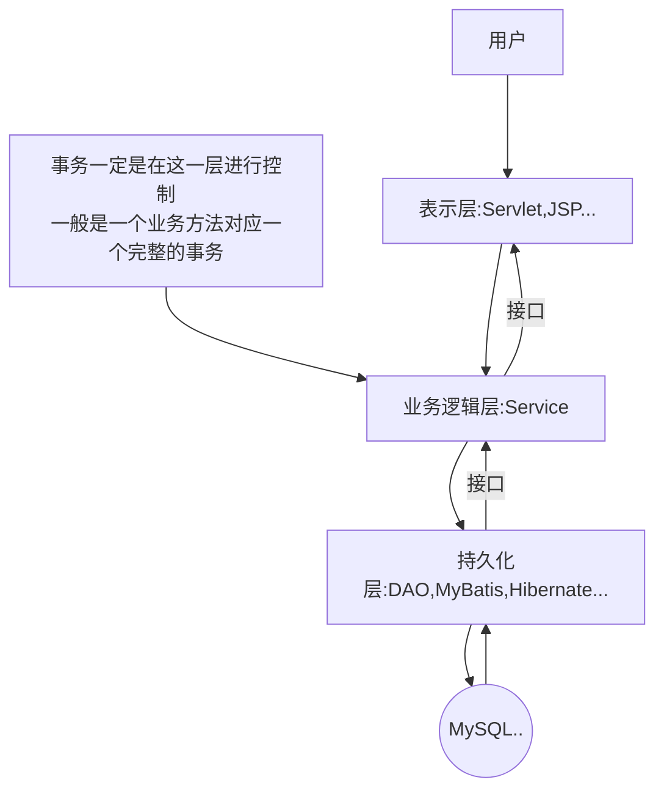

[TOC]

## 1.不使用MVC架构模式实现一个转账功能

### 1.系统构建过程

#### 1.需求分析

+ 从用户的角度入手，首先用户需要一个交互界面，这里我们直接在JSP中编写一个表单，用来给用户提交数据
+ 提交后的数据需要用一个Servlet来处理数据
+ Servlet连接数据库并完成CRUD操作
+ 将结果输出到页面中
+ 异常处理机制


#### 2.系统构建过程

+ 首先是新建一张数据库表，这里我们直接使用`Navicat`构建，并新建两个账户`binjunkai,zhangsan`来模拟转账操作

+ 编写JSP页面，这里只需要简单的提供数据输入的功能即可

    + ```jsp
        <%--
          Created by IntelliJ IDEA.
          User: binjunkai
          Date: 2023/2/6
          Time: 下午4:44
          To change this template use File | Settings | File Templates.
        --%>
        <%@ page contentType="text/html;charset=UTF-8" language="java" %>
        <html>
          <head>
            <base href="${pageContext.request.scheme}://${pageContext.request.serverName}:${pageContext.request.serverPort}${pageContext.request.contextPath}/">
            <title>Transfer</title>
          </head>
          <body>
          <form action="transfer" method="post">
            From account<input type="text" name="fromAct"/><br>
            To account<input type="text" name="toAct"/><br>
            Transfer amount<input type="text" name="money"/><br>
            <input type="submit" value="Transfer">
          </form>
          </body>
        </html>
        
        ```

+ 新建Servlet，重写doPost方法，在这里我们需要连接数据进行查询，若余额足够，则直接进行转账操作，否则抛出一个`MoneyNotEnoughException`，然后分别对两个账户进行更新操作，这里要使用事务，当账户都更新成功时在页面中打印结果，否则抛出`AppException`

    + ```java
        package com.javaMVC.bank.WebServlet;
        
        import com.javaMVC.bank.Exception.AppException;
        import com.javaMVC.bank.Exception.MoneyNotEnoughException;
        import jakarta.servlet.ServletException;
        import jakarta.servlet.annotation.WebServlet;
        import jakarta.servlet.http.HttpServlet;
        import jakarta.servlet.http.HttpServletRequest;
        import jakarta.servlet.http.HttpServletResponse;
        
        import java.io.IOException;
        import java.io.PrintWriter;
        import java.sql.*;
        
        /**
         * Transfer
         * @author binjunkai
         * @version 1.0
         * @since 1.0
         */
        @WebServlet("/transfer")
        public class AccountTransfer extends HttpServlet {
            @Override
            protected void doPost(HttpServletRequest request, HttpServletResponse response) throws ServletException, IOException {
                response.setContentType("text/html;charset=UTF-8");
                PrintWriter out = response.getWriter();
        
                Connection conn = null;
                PreparedStatement ps = null;
                ResultSet rs = null;
        
                String fromAct = request.getParameter("fromAct");
                String toAct = request.getParameter("toAct");
                double money = Double.parseDouble(request.getParameter("money"));
        
                try {
                    Class.forName("com.mysql.cj.jdbc.Driver");
                    String url = "jdbc:mysql://localhost:3306/mvc";
                    String name = "root";
                    String password = "root1234";
                    conn = DriverManager.getConnection(url, name, password);
                    conn.setAutoCommit(false);
        
                    String sql = "select * from t_act where actno = ?";
                    ps = conn.prepareStatement(sql);
                    ps.setString(1, fromAct);
                    rs = ps.executeQuery();
                    if (rs.next()) {
                        double balance = rs.getDouble("balance");
                        if (balance < money) {
                            throw new MoneyNotEnoughException("You do not have enough money to transfer");
                        }
                        String upd = "update t_act set balance = balance - ? where actno = ?";
                        String upd1 = "update t_act set balance = balance + ? where actno = ?";
        
                        ps = conn.prepareStatement(upd);
                        ps.setDouble(1, money);
                        ps.setString(2, fromAct);
                        int count = ps.executeUpdate();
        
                        ps = conn.prepareStatement(upd1);
                        ps.setDouble(1, money);
                        ps.setString(2, toAct);
                        count += ps.executeUpdate();
        
                        if (count != 2) {
                            throw new AppException("App Error found");
                        }else out.print("Transfer successful");
                        conn.commit();
                    }
                } catch (ClassNotFoundException | SQLException | MoneyNotEnoughException | AppException e) {
                    out.print(e.getMessage());
                    try {
                        conn.rollback();
                    } catch (SQLException ex) {
                        throw new RuntimeException(ex);
                    }
        
                }finally{
                    if (rs != null) {
                        try {
                            rs.close();
                        } catch (SQLException e) {
                            throw new RuntimeException(e);
                        }
                    }
                    if (ps != null) {
                        try {
                            ps.close();
                        } catch (SQLException e) {
                            throw new RuntimeException(e);
                        }
                    }
                    if (conn != null) {
                        try {
                            conn.close();
                        } catch (SQLException e) {
                            throw new RuntimeException(e);
                        }
                    }
                }
        
            }
        }
        
        ```

    + ```java
        package com.javaMVC.bank.Exception;
        
        /**
         * App Exception
         * @author binjunkai
         * @version 1.0
         * @since 1.0
         */
        public class AppException extends Exception {
            public AppException() {
                super();
            }
        
            public AppException(String message) {
                super(message);
            }
        }
        
        ```

    + ```java
        package com.javaMVC.bank.Exception;
        
        /**
         * MoneyNotEnoughException
         * @author binjunkai
         * @version 1.0
         * @since 1.0
         */
        public class MoneyNotEnoughException extends Exception{
            public MoneyNotEnoughException() {
                super();
            }
        
            public MoneyNotEnoughException(String message) {
                super(message);
            }
        }
        
        ```

+ 测试系统功能

### 2.分析当前系统存在的问题

#### 1.Servlet负责了的功能

+ 负责了数据接受
+ 负责了核心的业务处理
+ 负责了数据库表的CRUD操作
+ 负责了数据的页面展示
+ 负责了错误处理
+ ...


#### 2.当前系统存在的问题

+ 代码复用性差
    + 没有进行职能分工，没有独立组件的概念，代码和代码之间的耦合性太高，扩展力差
+ 操作数据库的代码和业务逻辑代码混杂在一起，容易出错，编写代码时无法专注于一个方面

---

## 2.MVC架构模式理解

### 1.系统为什么要分层？

+ 希望专人干专事，各司其职，职能分工明确，可以让代码的耦合度降低，扩展力增强，组件的服用性增强


### 2.MVC架构

#### 1.什么是MVC架构？

+ 在软件的架构中有一个著名的架构：MVC架构
    + M(Model：数据/业务) V(View：视图/展示) C(Controller：控制器)
    + C是核心


#### 2.MVC架构的工作流程





+ 层与层之间一般都是由接口去连接的，以此来降低耦合度，所以业务逻辑层和持久化层一般以接口的形式实现

#### 3.如何去构建一个MVC架构的系统？

+ 在上面对第一系统的分析我们知道，我们需要对系统进行分层，所以我们首先要把业务和数据操作分开，也就是将上面的`AccountServlet`拆分
+ 首先我们先编写一个`DBUtil`类来简化我们的数据库连接操作
+ 编写一个`Account`类来存储数据
+ 然后编写一个`AccountDAO`类来负责数据库的CRUD操作
+ 编写一个`AccountService`类来负责系统的业务逻辑


#### 4.DAO设计模式

+ 什么是DAO?
    + Data Access Object（数据访问对象）
    + DAO实际上是一种设计模式，属于`JavaEE`的设计模式之一
+ DAO中只负责数据库的CRUD，没有任何的业务逻辑在里面
+ 为什么上面我们要创建一个叫`AccountDAO`的类？
    + 因为这个DAO是专门处理`t_act`这张表的
    + 一般来说一张表对应一个DAO
+ DAO中的方法名相对来说是固定的
    + insert
    + deleteByXxx
    + update
    + selectByXxx
    + selectAll


#### 5.Bean

+ 什么是Bean？
    + 一般来说，使用一个Java类来作为一个数据保存对象，并且实现了有参和无参构造方法，同时实现了所有的setter和getter方法，那么这种单纯用来保存数据的类成叫做Bean,domain...
    + 如上文的`Account`类就是用来储存一个Account对象的
+ 对于其中的数据类型
    + 一般来说，在bean中的字段都会使用包装类来定义，并且数据类型要与数据库中的数据类型对应

---

### 3.ThreadLocal与事务的添加

#### 1.如何添加事务？

+ 上文我们已经说到，我们需要在业务逻辑层（service）添加事务，为什么要在这里添加事务呢？

    + 因为一个service可能会调用多次DAO，对数据库的删改操作一定要加入事务，因为多次对数据库的操作必须同时成功，否则同时失败

+ 事务的添加过程

    + 首先我们知道，对事务的操作需要使用到`Connection`对象，那么我们在service层就必须创建`Connection`对象，并且在DAO中使用`相同`的连接对象

    + 这里我们可以了解一个语法糖

        + ```java
            try(Connection conn = DBUtil.getConnection()){
            }
            //在try语句执行后会自动的释放资源
            ```

    + 那么怎么让所有的DAO使用相同的连接对象呢？

        + 使用连接池ThreadLocal


#### 2.ThreadLocal连接池

+ 什么是ThreadLocal？

    + ThreadLocal是连接池，他是一个Map集合，key是当前线程，value就是连接对象Connection

+ 连接池图示

    + ```mermaid
        %%{init: { "theme" : "dark" }}%%
        erDiagram
        ThreadLocal{
        Thread1 Connection1
        Thread2 Connection2
        Thread3 Connection3
        Thread4 Connection4
        }
        ```

+ 每个线程都对应着一个连接对象，这意味着只要是在在同一个线程中，必然会获得同一个连接对象，那么这样就解决了DAO使用同一个连接对象的问题

+ 连接池中的连接对象的创建应该是`饿汉式`，即先判断是否存在连接对象，不存在则创建，否则直接返回连接对象

+ 在使用完成连接对象后，释放连接对象时需要同时移除连接池中的连接对象，为什么要这样做？

    + 因为在Tomcat中内置了一个线程池，线程对象是早就创建好的，线程使用完成后不会释放而是会重新分配给有需要的用户，如果不释放，就会使用错误的连接对象


### 4.分包

+ 一般来说，我们会将相应的文件放到相应的包下，这样方便我们的管理，那么怎么去分包呢？

    + bean包
    + service包
    + dao包
    + web包
    + exceptions包
    + utils包

+ 但是在实际编程中来说，我们需要对接口编程来降低程序的耦合度，所以我们一般在包中放的是接口，在包中新建一个impl包，里面放接口的实现类

    + > /service
        >
        >    |-->/impl
        >
        >    |     |-->`AccountServiceImpl`
        >
        >    |-->`AccountService(interface)`
        >
        > 
        >
        > /dao
        >
        >    |-->/impl
        >
        >    |     |-->`AccountDaoImpl`
        >
        >    |-->`AccountDao(interface)`

+ 在层与层之间的调用过程中应该使用`父类型引用指向子类对象`


### 5.当前项目仍然存在的问题

+ 在service层控制了事务，service方法中的事务控制代码看着有些别扭，如何解决？
    + 使用动态代理
+ 虽然面向接口编程了，但是并没有完全解决对象与对象之间的依赖关系，如何解决？
    + 交给spring容器来解决这件事，使用spring的IoC容器


